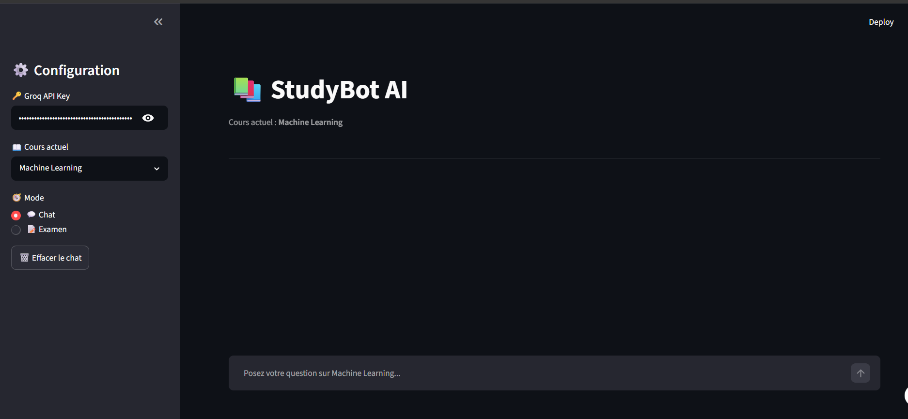
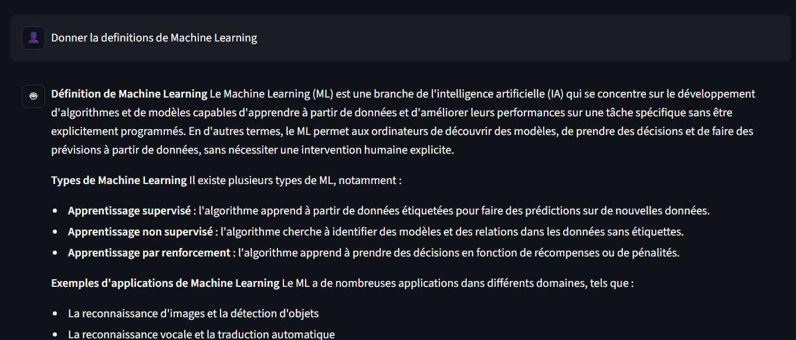
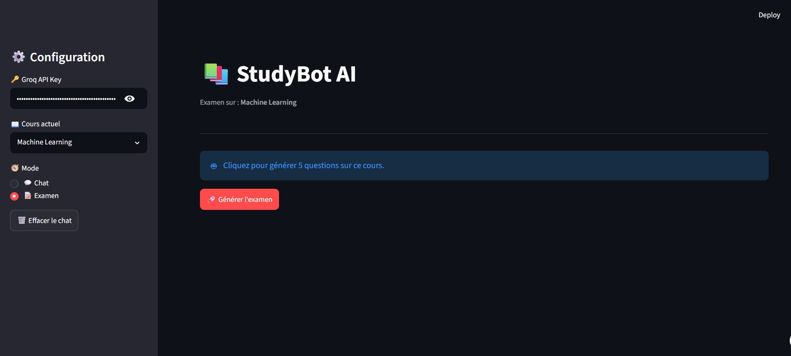
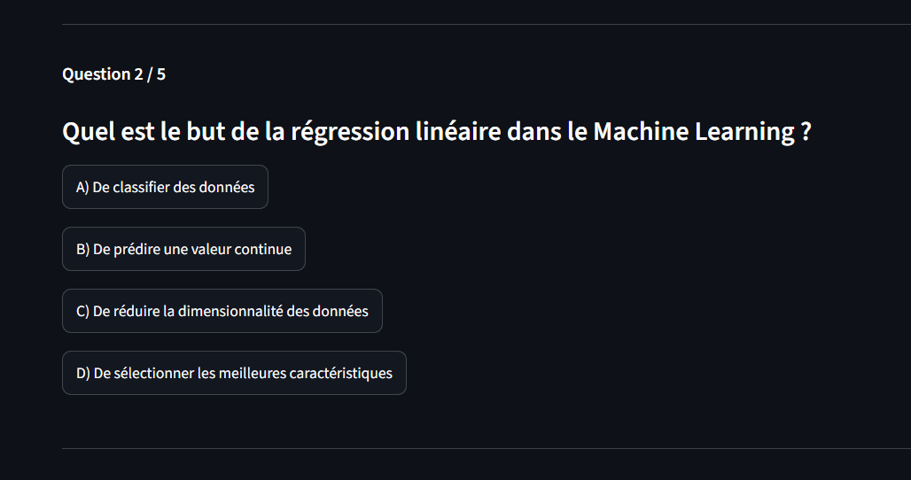
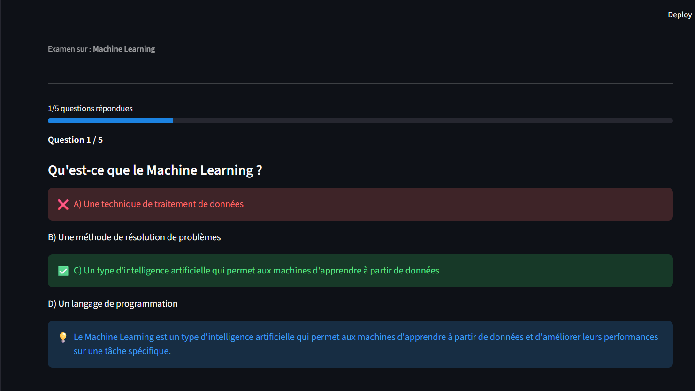

# 📚 StudyBot AI
> Assistant de révision intelligent basé sur un modèle de langage (LLM), permettant de poser des questions de cours et de générer automatiquement des examens QCM.

---

## 🎯 Fonctionnalités

- 💬 **Chat de révision** : pose des questions sur tes cours et reçois des explications claires
- 📝 **Mode examen QCM** : génération automatique de 5 questions à choix multiples
- ✅ **Correction instantanée** : feedback immédiat avec explications
- 🏆 **Score final** : résultat global à la fin de l'examen
- 📚 **Multi-domaines** : Machine Learning, NLP, Deep Learning, etc.
- ⚡ **Rapide** : réponses générées via API Groq

---

## 🤖 Modèle utilisé

- **LLaMA 3.3 70B** (Meta)
- Accès via **Groq API**
- Type : modèle génératif **(Transformer / LLM)**

---

## 🖼️ Captures d'écran

### Mode Chat



### Mode Examen




---

## 🎬 Démo vidéo

[▶️ Voir la démonstration](https://www.loom.com/share/ca02b3a5961b405c9f1b1f921234251e)

---

## 🚀 Installation

### 1. Cloner le projet
```bash
git clone https://github.com/wiem500/studybot-ai/upload
cd studybot-ai
```

### 2. Créer un environnement virtuel
```bash
python -m venv .venv

# Windows
.venv\Scripts\activate

# Mac/Linux
source .venv/bin/activate
```

### 3. Installer les dépendances
```bash
pip install -r requirements.txt
```

### 4. Ajouter la clé API

Créer le fichier `.streamlit/secrets.toml` et ajouter :
```toml
GROQ_API_KEY = "votre_cle_api"
```

### 5. Lancer l'application
```bash
streamlit run app.py
```

Puis ouvrir : `http://localhost:8501`

---

## 📁 Structure du projet

```
studybot-ai/
├── app.py
├── requirements.txt
├── README.md
├── .gitignore
├── .streamlit/
│   └── secrets.toml        ← clé API (non commitée)
└── docs/
    ├── screenshot-chat.png
    └── screenshot-exam.png
```

---

## ☁️ Déploiement (Streamlit Cloud)

1. Pousser le projet sur GitHub
2. Aller sur [share.streamlit.io](https://share.streamlit.io)
3. Connecter le repository
4. Ajouter dans **Settings → Secrets** :
```toml
GROQ_API_KEY = "votre_cle_api"
```
5. Déployer 🚀

---

## 🛠️ Technologies

| Composant     | Technologie          |
| Interface web | Streamlit            |
| Modèle LLM    | LLaMA 3.3 70B (Meta) |
| Inférence     | Groq API             |
| Langage       | Python 3.10+         |

---

## 📄 Licence

MIT License — Projet académique